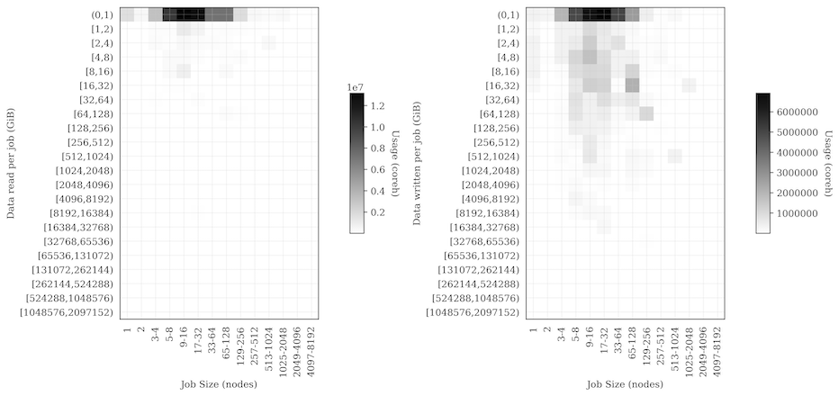

# Attending organisations

# Actions

   - (EPCC) Check with EPSRC about status of Autumn RAP Open Access to Tier-2 call

# National HPC RSE Updates

## ARCHER, Cirrus, EPCC

   - Published paper describing different I/O patterns on ARCHER using data from Cray LASSi tool imported into EPCC SAFE.
      + [http://www.archer.ac.uk/documentation/white-papers/safe-lassi/SAFE_LASSi_IO-Monitoring.pdf](http://www.archer.ac.uk/documentation/white-papers/safe-lassi/SAFE_LASSi_IO-Monitoring.pdf)
      + For example, here are two plots showing the very different I/O patterns (across all jobs) for two consortia - Materials Chemistry Consortium and National Centre for Atmospheric Science

MCC:

NCAS:

   - Configured the Cirrus Web Object Store (WOS) to allow users to push data from Cirrus into the large object storage using AWS S3 interface. (Use the `s3cmd` toolset to manipulate data)
   - Included adding functionality in SAFE to be able to setup storage buckets and provide access keys and associated secrets to control access.
   - Interested in testing with other sites.

## Isambard, GW4

   - Overall utilisation has now ramped up such that the system is nearly full a lot of the time.
      + Working on monitoring to measure this
   -  VASP jobs currently account for the vast majority of our core hours, with QuantumESPRESSO, GROMACS, CP2K, GAMESS-UK, and some other codes from the RAP allocations making an appearance too.
   - Benchmarking efforts continue; we’re just working on a follow-on from our CUG paper which will which will feature more comparisons between the three different compilers we have, along with comparisons to our Catalyst system.

## Thomas, MMM Hub

   - Looking Intel 2019 Update 4 compiler and MPI to see whether the cases we had that failed with Intel 2018 worked with it
       + Cannot currently test the MPI over multiple nodes as our version of libfabric is too old. We previously always used tmi.conf for configuration and that has now been deprecated and several variables we used to use removed, so it took some time to work out what the issue was.
       + Not helped by the numbering of libfabric! It requires libfabric >= 1.7.0 and we have libfabric.1.9.so which is actually version 1.5.0. So we cannot test further until we have updated. The current status is hanging when trying to run multinode jobs.
       + We are expecting the MKL issues to be fixed, but for potential MPI issues to show up in their place.
       + I found "Fixed the problem that caused ScaLAPACK SVD routine to return incorrect array sizes." to be an interesting MKL bugfix note.
   - We are reconsidering what our default compiler and MPI ought to be, since the last several Intel versions have had issues that affect the code our users are running.
   - We also just finished running our annual survey of Thomas users.
   - 
# Other topics

# Upcoming training, events and meetings

   - RSE for HPC Meeting, Birmingham, PM 16 Sep 2019
      + Associated with RSEConUK19, Birmingham
      + James Grant (Bath) and Jo Beech-Brandt (EPCC) organising
      + [Registration link](https://docs.google.com/forms/d/e/1FAIpQLSdId3jE3Z2v9aq_ylHrsh9ybu-pU0ojXj7ae5xrks-vZLAHiw/viewform?usp=sf_link)
   - RSEConUK 2019, Birmingham, 17-19 Sep 2019
      + Tickets selling out fast!

   - Upcoming ARCHER Training Opportunities. Full details and registration at [http://www.archer.ac.uk/training/index.php](http://www.archer.ac.uk/training/index.php)
      + Good Practice for transferring data Virtual Tutorial, Wednesday 4th September 2019 15:00 
      + Enabling distributed kinetic Monte Carlo simulations for catalysis and materials science, Webinar, Wednesday 25th September 2019 15:00 
      + Programming the ARM64 processor, Cambridge, 30 Sep - 1 Oct 2019 
      + Hands-on Introduction to HPC for Life Scientists, Birmingham, 30 Oct - 1 Nov 2019 
      + Shared-memory Programming with OpenMP - Online course, four Wednesday afternoons, 13, 20, 27 November and 4 December 2019 

# Date of next meeting

TBC
