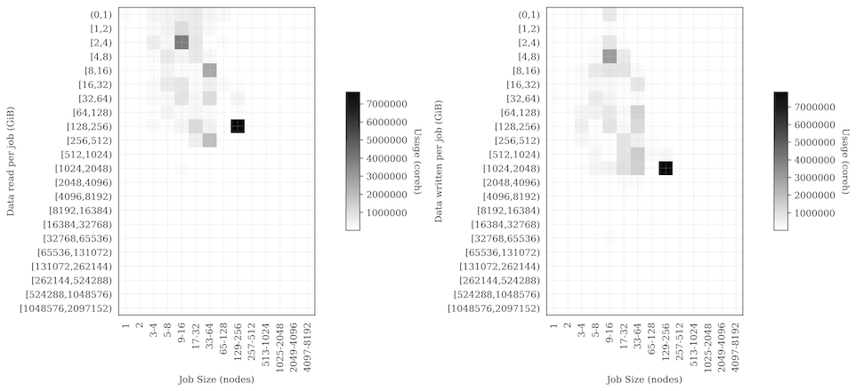

# Attending organisations

  - EPCC, The University of Edinburgh (ARCHER, Cirrus)
  - DAMPT, University of Cambridge
  - UCL (MMM Hub)
  - University of Bristol (GW4 Isambard)
  - Aberystwyth University
  - University of Southampton
  - Loughborough University (HPC Mid+)
  - University of Birmingham
  - University of Sheffield (JADE)
 
# Actions

   - (Andy Turner, EPCC) Put out vote for updated time for the meeting

# National HPC RSE Updates

## ARCHER, Cirrus, EPCC

   - HPC Carpentry is now configurable for different HPC systems making it easier to take the material and reuse 

   - Published paper describing different I/O patterns on ARCHER using data from Cray LASSi tool imported into EPCC SAFE.
      + [http://www.archer.ac.uk/documentation/white-papers/safe-lassi/SAFE_LASSi_IO-Monitoring.pdf](http://www.archer.ac.uk/documentation/white-papers/safe-lassi/SAFE_LASSi_IO-Monitoring.pdf)
      + For example, here are two plots showing the very different I/O patterns (across all jobs) for two consortia - Materials Chemistry Consortium and National Centre for Atmospheric Science

MCC:

NCAS:

   - Configured the Cirrus Web Object Store (WOS) to allow users to push data from Cirrus into the large object storage using AWS S3 interface. (Use the `s3cmd` toolset to manipulate data)
   - Included adding functionality in SAFE to be able to setup storage buckets and provide access keys and associated secrets to control access.
   - Interested in testing with other sites.
   - See: [https://cirrus.readthedocs.io/en/master/user-guide/object_store.html](https://cirrus.readthedocs.io/en/master/user-guide/object_store.html)

## Isambard, GW4

   - Steady stream of new users coming onto the system
   - Setting up the RSE support network across the four different CSE sites

## Thomas, MMM Hub

Business as usual

   - Updated the default python3/recommended from Python 3.6.3 to 3.7.4
   - Got Intel MPI 2019 update 4 working on Thomas (OmniPath, PSM2), but on Truescale with PSM 1 on our other cluster it is falling back to sockets, and after some reading it may only work with verbs if it does at all. PSM vanished from their documentation somewhere between May 2018 and March 2019. Libfabric reports it is requesting FI_DIRECTED_RECV which is not supported by PSM 1.
   - have not investigated possible bugs with it
   - Have made a public repo for our SAFE ticket parser. I am hoping to have example tickets included soon. https://github.com/UCL-RITS/MMMHub-SAFE

## JADE

   - Looking at ways of extracting usage data off the system

# Other topics

## Shared HPC RSE knowledge base

   - Initial discussion of how to provide a collaborative HPC RSE knowledge base at the HPC Champions workshop co-located with RSEConUK in September 2019. There was a large amount of interest in this and attendees though it would be a very useful idea to pursue.
   - Andy Turner (EPCC) has an action from HPC Champions to put together a blog post discussing options and ideas
   - One proposal that generated a lot of interest would be to use Stack Overflow and appropriate tagging to deliver this
   - Also pointed out that US sites tried to setup a site under Stack Exchange but failed to get enough community buy-in (although the buy-in bar is **very** high)
   - There is also the [https://ask.cyberinfrastructure.org/](https://ask.cyberinfrastructure.org/) site setup by US sites (in the wake of the failed Stack Exchange attempt) which may be a possibility for this.
   - Interest in running a (virtual?) hack day event to bootstrap the HPC RSE knowledge base in first half of 2020.
   - The shared knowledge base needs to be well-indexed by Google and other search engines so people can find the information and answers they need.
   
## Change of meeting time 

   - A number of people have nited that 2pm on a Tuesday always clashes with local meetings.
   - The original time was chosen to suit the national HPC facilities representatives (as this is where the meeting originated) but this may not be appropriate going forward with the wider attendence at the meeting.
   - Plan to put out a vote widely across potential attendees to try and identify the least worst time for the meeting on a monthly basis.

# Upcoming training, events and meetings

   - Upcoming ARCHER Training Opportunities. Full details and registration at [http://www.archer.ac.uk/training/index.php](http://www.archer.ac.uk/training/index.php)
      + LAMMPS workshop, Online, 16 and 23 October 2019
      + Hands-on Introduction to HPC for Life Scientists, Birmingham, 30 Oct - 1 Nov 2019
      + Free "Supercomputing" MOOC starting on 14th October 2019
      + A Fully Lagrangian Dynamical Core for the Met Office/NERC Cloud Model, Online webinar, 13th November 2019 15:00
      + Shared-memory Programming with OpenMP - Online course, four Wednesday afternoons, 13, 20, 27 November and 4 December 2019
      + Scientific Programming with Python, Queen's University Belfast, 16-17 December 2019
      + HPC Carpentry, EPCC, Edinburgh, 9 - 10 December 2019

# Date of next meeting

1400 UK Time, TBC Nov 2019
